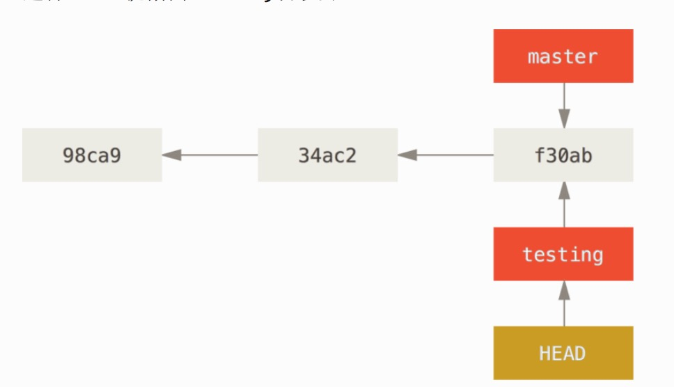
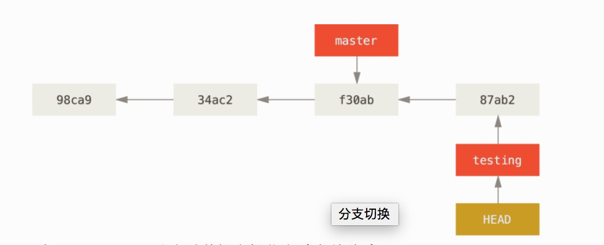
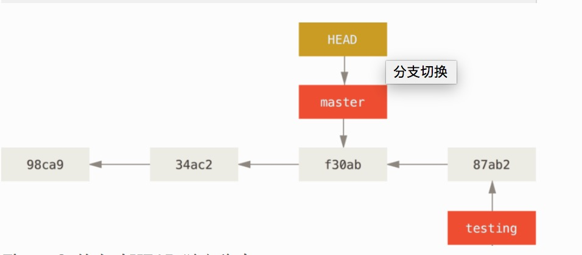
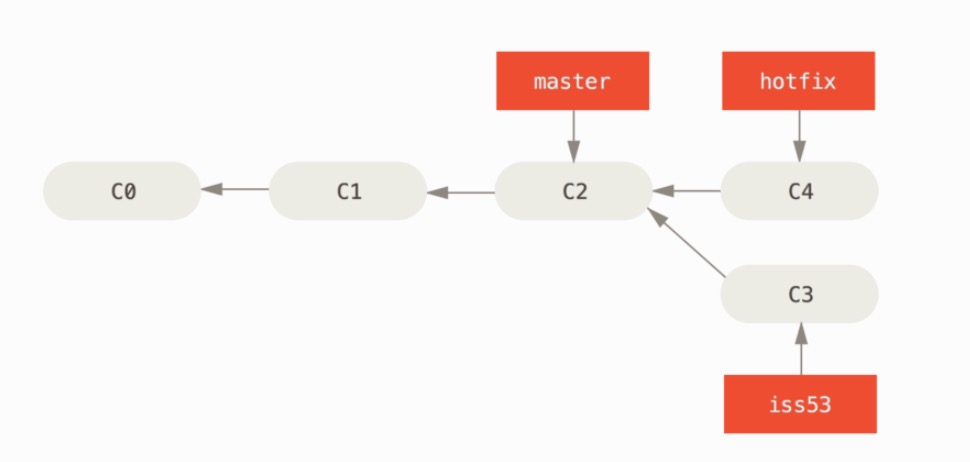
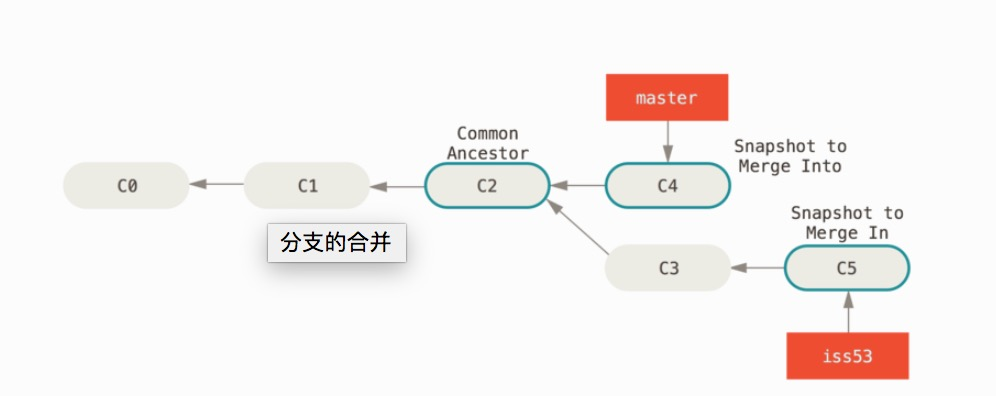
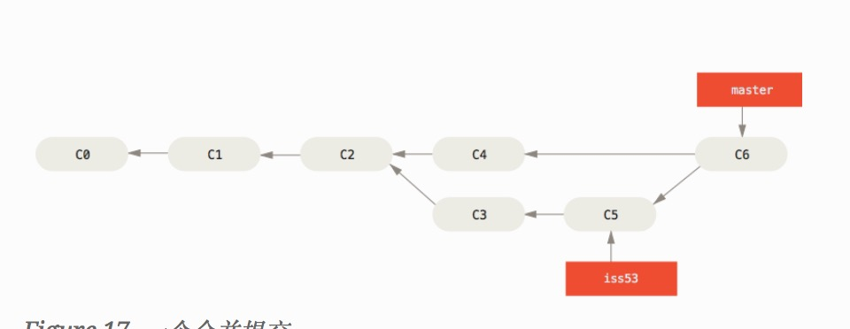
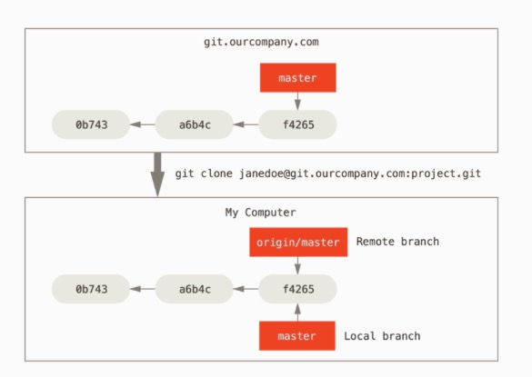
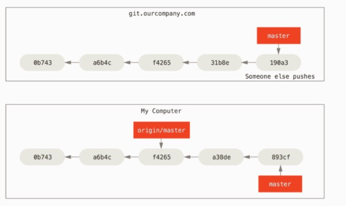

# Git 分支

## 3.1 分之简介

几乎所有的版本控制系统都以某种形式支持分支。使用分支意味着你可以把你的工作从主线上分离出来。以免影响开发主线。

而Git的分支模型更是其 **必杀特性** ，因为其分支操作有着难以想象的便捷。分支的创建、切换和合并就像普通的提交一样简单。这一切都源于其优秀的数据管理方式：直接记录快照，而非差异比较。每一次提交Git都会保存一个提交对象（commit object），改提交对象包含了一个指向暂存内容快照的指针和其他提交信息，多次提交又会通过父子关系形成一个关系树。

因为每一次提交都包含着文件快照，而文件快照有几乎是提交版本的文件复制版本。而分支的创建本质上又仅仅是创建了一新的指向某个提交的 **可移动的** 指针，所以每一次分支的创建就变得相当的快捷，而切换等操作亦是如此。这也就意味着所有分支之间的差异只是指针的不同，其他分支和主分支并没有其他特殊的差异。

**注：特殊的HEAD指针： 这个指针所指向的就是当前所在的分支。**

### 分支创建 

使用 "git branch" 命令创建一个新的分支，这会创建一个新的可移动的指向当前提交的指针。

	$ git branch testing
	$ git branch testing2
	
可以使用 git log --decorate 命令查看各个分支所指向的对象（也就是所对应的提交对象）

	git log --oneline  --decorate
	11fe38d (HEAD -> master) 新提交
	a3f6189 (testing, testing2) init
	
由此可以看出当前的HEAD分支是master 指向的是 ‘11fe38d’ 提交， 由于test1，和test2都是在 ‘a3f6189’ 提交上创建的，所以此时两个分支都还是只想这个提交的，而当你切换到test1分支并进行一次修改提交后，test1就会指向最新的提交了。

### 分支切换

使用 "git checkout [brach-name]" 切换到其他分支。

	$ git checkout testing
	

切换后 HEAD 将会指向新的标签。如图：

在testing分支上进行一次修改后再提交：

由此可以看出testing分支 **向前移动了**，但是master分支仍然在原本的分支上。此时我们在切回master分支上：

	$ git checkout master

由着三个图基本上就可以看出分支的工作原理和其特性了，即： 

* 可移动的
* 指向提交对象的校验和

那么在进行分支切换时，Git 具体都做了什么实现分支的切换呢？

1. 使HEAD指向最新的分支。
2. 将工作目录恢复成当前分支所指向的提交的快照内容。

**注： 切分分支时，一定要注意你的工作目录文件会被改变**

上述两次改动针对的是不同的分支：你可以在不同的分支上不短的来回切换和工作，并在时机成熟时将他们合并起来。而这些工作，你需要的命令只有branch、checkout和commit。

使用 “git log --oneline --decorate --graph --all” 可以查看你的提交历史、各个分支的指向以及项目的分叉情况。

	git log --oneline --decorate --graph --all
	* 59c9c41 (test1) test1 新提交
	| * 11fe38d (HEAD -> master) 新提交
	|/
	* a3f6189 (test2) init

**总结：由于Git分支的实质上仅是包含了所指向对象的校验和（长度为40的SHA-1值字符串）文件，所以它的创建和销毁都异常高效，想想创建一个新分支就相当于往一个文件中写入了41个字符（40个字符和一个换行符），如次简单能不快吗？**

**与过去的大多数版本控制系统形成了鲜明的对比，他们在创建分支时，将所有项目文件都复制一遍，并保存到一个特定的文件目录。完成这样的一个操作，其耗时完全取决于项目规模，如果项目过大，其效率简直无法想象，而在 Git 中，任何项目规模都能在瞬间创建新分支。同时，由于每次提交都会记录父对象，所以 *寻找恰当的合并基础* 也是同样的高效。这些高效的特性使得 Git 鼓励开发人员频繁的创建和使用分支。**

## 3.2 分支的新建与合并

### 新建分支

使用 "git checkout -b [branch-name]" 创建并切换到新的分支上。

	$ git checkout -b iss53
	Switched to a new branch "iss53"
	
它是下面两条命令的简写：

	$ git branch iss53
	$ git checkout iss53

现在你可以自如的在两个分支上切换，并发开发。但是要注意的是，每次切换到其他分支之前，必须要保证当前分支的所有内容都已经提交了。 有时候你可能急需切换分支，但是当前的分支的修改内容又没有完成，不值得进行一提交，那么你可以使用一些方法绕过这个问题（既保存进度：（stashing） 和 修补提交 （commit amend-ing））。

如果你在修改子分支的同时又修改了主分支，而此时你想先把主分支做的修改也同步到自分支上，那么你可以切换到自分支上，然后将主分支的新提交合并进来,你可以使用 git merge master 命令将 master 分支合并入 iss53 分支，或者你也可以等到 iss53 分支完成其使命后，再将其合并会 master 分支。

### 分支的合并

对于下面这个分支示例的合并可能会有三种情况：

* 如果当前 master 分支所指向的提交时你当前提交的直接上游，也就是说当顺着一个分支走下去能到达另一个分支，那么 Git 在合并两者的时候只会简单的将指针向前推进，这种情况下的合并操作没有需要解决的分歧 ———— 这叫做 “快进（fast-forward）”。

	
		$ git checkout master
		$ git merge hotfix
		Updating f42c576..3a0874c
		Fast-forward
		index.html | 2 ++
		1 file changed, 2 insertions(+)

	
* 当你已经在 master 和 iss53 分支上都分别已经做过提交了，并且此时 master 分支所在的提交不再是 iss53分支的直接祖先，这时 Git 会使用两个分支末端所指向的快照（C4 和 C5）以及两个分支的工作祖先（C2），做一些简单的三方合并。和之前将当前分支指向推进所不同的是，Git 此次将三方合并的结果做了一个新的快照，并且自动创建了一个新的提交指向他。这个被称作一个次合并提交，它的特别之处在于他有不止一个父提交

		$ git checkout master
		Switched to branch 'master'
		$ git merge iss53
		Merge made by the 'recursive' strategy.
		index.html |    1 +
		1 file changed, 1 insertion(+)”
		

* 遇到冲突时的分支合并。如果你在两个不同的分支中，对同一个文件的同一个部分进行了不同的修改，那么此时 Git 就无法自动合并他们。此时 Git 做了合并，但是没有自动的创建一个新的合并提交。Git 会停下来，等你去解决合并产生的冲突。

		$ git merge iss53
		Auto-merging index.html
		CONFLICT (content): Merge conflict in index.html
		Automatic merge failed; fix conflicts and then commit the result.

	你可以在合并后的使用 git status 命令来查看哪些因为包含冲突而处于未合并状态（unmerged）的文件。
	
		$ git status
		On branch master
		You have unmerged paths.
		  (fix conflicts and run "git commit")
		
		Unmerged paths:
		  (use "git add <file>..." to mark resolution)
		
		    both modified:      index.html
		
		no changes added to commit (use "git add" and/or "git commit -a")
		
		
	当你解决完所有冲突之后，就可以暂存并提交此次合并了。
	
	
	

## 3.3 分支管理

* 查看全部分支及当前所在的分支
		
		$ git branch
		  iss53
		* master // * 表示当前所在分支
		  testing
		
		
* 删除分支 
		
		$git branch -d iss53
		
* 查看每一个分支的最后一次提交

		$ git branch -v

* 查看已经合并到当前分支的分支

		$ git branch --merged

* 查看所有未合并的工作分支

		$ git branch --no-merged
	

### 3.4 分支开发工作流

分支开发工作流： 由分支开发衍生出的典型工作模式。

* 长期分支
* 特性分支

## 3.4 远程分支

**远程引用是对远程仓库的引用**，包括分支、标签等。可以通过 git remote show （remote） 获得远程分支的更多信息。然而一个更常见的做法是利用远程跟踪分支。

*远程引用本质是一些指针，这些指针是对远程仓库的引用。包括分支、标签等的引用。*

**远程跟踪分支是远程分支状态的引用**。它是你不能移动的本地引用，当你做任何网络操作时（pull 或者 ？），他们会自动移动。远程跟踪分支像是你上次连接到远程仓库时，那些分支所处的状态的书签。

*也就是说远程跟踪分支实质上也就是一个指针，指向远程分支中的某次提交。标识本地已知的远程分支状态（进度）。*

**不管是远程引用，还是远程跟踪分支，都是对远程仓库里一些提交引用。就像本地分支也只是某次提交的指针一样，只不过这些指针的含义是对远程的引用。**

如图所示： orgin/master 这个远程跟踪分支，对于本地来说，就是一个指向某次提交的特殊指针。**标识了上次更新时的远程分支相对于本地分支的位置**。

远程跟踪分支**并不代表远程分支此时的最新状态**，它只是标识上一次更新时远程分支的状态，在上一次更新后，远程分支上可能会因为合作者推送了一些新的提交导致远程分支实际的状态是先进与本地的远程跟踪分支的。如图所示：

### 推送

当你想要公开分享一个分支时，你可以使用 git push （remote） （branch） 命令将当前分支推送到远程仓库（remote） 的 （branch） 分支上。

	$ git push origin serverfix
	

当然你也可以将指定的本地分支推送到指定远程仓库的指定分支上。 git push (remote) (local-branch):(remote-branch)。

	$ git push origin serverfix:serverfix

当其他协作这想要获取你最新提交的远程分支时，他可以通过 git fetch origin 抓取数据，此时他会抓取到新的**远程跟踪分支**。注意，此时抓取到的**远程跟踪分支**，这是一个指针， 并非一个可编辑的本地副本（拷贝）。
	
	$ git fetch origin

此时可以运行 git merge origin/serverfix ，将这些工作合并到当前所在的分支。 也可以创建一个**建立在远程跟踪分支之上**的新的serverfix本地分支。

	$ git checkout -b serverfix origin/serverfix
	

### 跟踪分支

从一个远程跟踪分支上检出一个本地分支会自动创建一个叫做”跟踪分支“（有时也叫做”上游分支“）。跟踪分支是与远程分支有直接关系的本地分支。此时如果在一个跟踪分支上输入 git pull ，Git 能自动识别去哪个服务器上去抓取合并数据。

当克隆一个仓库时，所有的本地分支实际上都是跟踪分支。不过默认情况下克隆只会自动的创建一个 master 分支。 但是之后你也可以在检出其他分支。 利用 git checkout -b  [branch] [remotename]/[branch]

你也可以设置一个已有的本地分支跟踪一个刚拉取下来的远程分支，或者修正正在跟踪的上游分支。可以使用 -u 或者 --set-upstream-to 选项 运行 git branch 来显式的设置。

	$ git branch -u origin/serverfix
	

如果要查看设置的所有跟踪分支，可以使用 git branch -vv 命令。

	$ git branch -vv
	  iss53     7e424c3 [origin/iss53: ahead 2] forgot the brackets
  	  master    1ae2a45 [origin/master] deploying index fix
	* serverfix f8674d9 [teamone/server-fix-good: ahead 3, behind 1] this should do it
  	testing   5ea463a trying something new
  	
  	
  	
  
### 拉取
 
当使用 git fetch 命令从服务器上拉取数据时，它并不会修改工作目录的内容。此时的拉取只是更新了远程跟踪分支，如果你想要将这些更新并入跟踪分支，你还需要执行 git merge 去主动的合并。当然你也可以使用 git pull 直接完成这两步操作。
 
 
### 删除远程分支
 
 $ git push origin --delete serverfix。
 
 
基本上这个命令做的只是从服务器上移除这个指针。 Git 服务器通常会保留数据一段时间直到垃圾回收运行，所以如果不小心删除掉了，通常是很容易恢复的。

	

	
	
	

