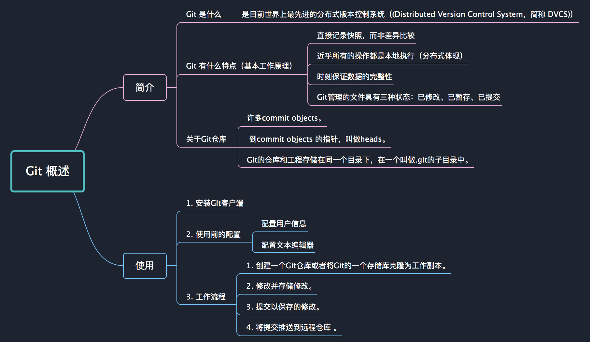

Git Book 地址 ： https://git-scm.com/book/zh/v2

##Git 是什么？

Git是目前世界上最先进的分布式版本控制系统（没有之一）。

##Git 有什么特点？

1.  直接记录快照，而非差异比较
2.  近乎所有的操作都是本地执行（分布式体现）
3.  时刻保证数据的完整性

## Git 基本工作原理

*   直接记录快照，而非差异比较（文件对比方式）

Git 和其它版本控制系统(包括 Subversion 和近似工具)的主要差别在于 Git 对待数据的方法。 概念上来区分，其它大部分系统以文件变更列表的方式存储信息。 这类系统(CVS、Subversion、Perforce、Bazaar 等等)将它们保存的信息看作是一组基本文件和每个文件随时间逐步累积的差异。存储每个文件与初始版本的差异。 Git 不按照以上方式对待或保存数据。 反之，Git 更像是把数据看作是对小型文件系统的一组快照。 每次你提交更新，或在 Git 中保存项目状态时，它主要对当时的全部文件制作一个快照并保存这个快照的索引。 为了高效，如果文件没有修改，Git 不再重新存储该文件，而是只保留一个链接指向之前存储的文件。 Git 对待数据更像是一个 快照流。

*   近乎所有的操作都在本地执行

在Git中的绝大多数操作都只需要访问本地文件和资源。不想svn 每一次提交都需要联网。 这也意味着你离线或者没有 VPN 时，几乎可以进行任何操作。 如你在飞机或火车上想做些工作，你能愉快地提交，直到有网络连接时再上传。

*   Git 保证完整性

Git 中所有数据在存储前都计算校验和，然后以校验和来引用。 这意味着不可能在 Git 不知情时更改任何文件内容或目录内容。 这个功能建构在 Git 底层，是构成 Git 哲学不可或缺的部分。 若你在传送过程中丢失信息或损坏文件，Git 就能发现。

*   Git 一般只添加数据

你执行的 Git 操作，几乎只往 Git 数据库中增加数据。 很难让 Git 执行任何不可逆操作，或者让它以任何方式清除数据。

*   Git 的三种状态：

    *   已提交（comitted）
    *   已修改（modified）
    *   已暂存（staged）

## 安装GIt

下载地址 ： https://git-scm.com/downloads

## Git 使用前配置

Git 自带一个 git config 的工具来帮助设置控制 Git 外观和行为的配置变量。 这些变量存储在三个不同的位置，使用不同的选项调用。

* --system  /etc/gitconfig 文件: 包含系统上每一个用户及他们仓库的通用配置。
* --global  ~/.gitconfig 或 ~/.config/git/config 文件：只针对当前用户。
* 不加参数   使用当前 仓库的 Git 目录中的 config 文件(就是 .git/config)：针对该仓库。

###配置用户信息

	$ git config --global user.name "maxsu"
	$ git config --global user.email maxsu@yiibai.com

### 配置文本编辑器 
     当 Git 需要您输入信息时会调用它。默认 Vim

	$ git config --global core.editor emacs

###查看所有配置信息

	git config --list

### 关于Git仓库

Repository（仓库）：Git的目标是管理一个工程，或者说是一些文件的集合，已跟踪他们的变化。Git使用Repository来存储这些信息。一个仓库主要包含一下内容：

* 许多commit objects。
* 到commit objects 的指针，叫做heads。
* Git的仓库和工程存储在同一个目录下，在一个叫做.git的子目录中。

##Git 工作流程

1. 创建一个Git仓库或者将Git的一个存储库克隆为工作副本。
2. 修改并存储修改。
3. 提交以保存的修改。
4. 将提交推送到远程仓库 。

