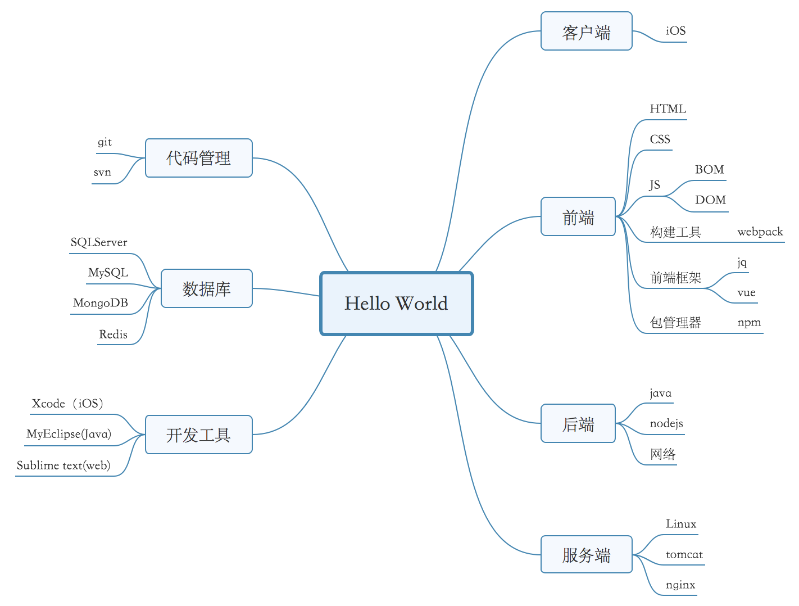

# notes
笔记范围

* 20180719-20180726： Git 第一阶段整理到此结束，这个阶段主要这里 Git 的基本原理和基础用法。高级内容后续分模块整理
* 201800801 搭建了自己的私有云，终于不用在考 Git 来保证两台电脑的同步了。之后的提交就整理完一些模块后统一提交了，已保证日志的优美 ^_^。
* 201810-20181123 历时近两个月有重新整理了一遍 HTMLL CSS JS的基础概念，对Web 是什么，能做什么又有了新的理解，特别对JS 是什么，能做什么，为什么又有了更好的理解。这一次的整理以了解完整生态，认知Web框架概念为目的。所以整理的内容也不会太过详尽。至于具体的用法，和一些新的框架概念则没有进行整理。对于这些具体实用的东西以后将会以博客的形式进行整理，以期自己能更好的掌握与运用。
