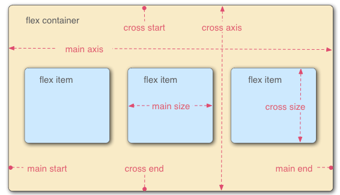
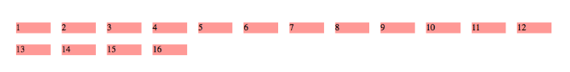

CSS 的排版包括浮动和定位的传统布局方法，以及像flexbox这样的现代布局工具。


# 1. 介绍

CSS 布局概念：

* 浮动
* 定位
* CSS 表格
* 弹性盒子
* 网格


### 1.1 正常流布局

正常布局流是指在不对页面进行任何布局控制时，浏览器默认的HTML布局方式。---- 按照元素顺序和元素类型（块元素、内联元素、行内元素）排序。


通过布局技术会覆盖默认的布局行为：

* position 属性 -- 正常的布局流中，默认为 static
* 浮动  ----  应用flot值。如left 能够让块级元素相互并排成一行。
* display 属性 ---- 标准值 block，inline or inline-block 会改变元素在正常布局流中的行为方式。而一些不常见的，特殊值则允许我们使用完全不同的方式进行布局。

### 1.2 浮动


float 属性默认有四个可能订的值：


* left --- 将元素浮动到左侧。
* right ---- 将元素浮动到右侧。
* none ---- 默认值，不浮动。
* inherit   ---- 继承父元素的浮动属性。


### 1.3 定位技术


定位技术 position 允许我们将一个元素从他在页面的原始位置准确的移动到另一个位置。


有四种主要类型：

* **静态定位**（static positioning）默认属性
* **相对定位** （Relative positioning） 允许我们相对元素在正常的文档流中的位置移动它。----  包括将两个元素叠放在页面上。这对于微调和精准射击非常有用。
* **绝对定位**（absolutee positioning） 将元素从从页面的正常布局流中移出，类似将他单独放在一个图层。我们可以将元素相对于页面的html元素边缘固定，或者相对于离元素最近的被定位的祖先元素。绝对元素定位在创建复杂布局效果时非常有用。
* **固定定位** （Fixed positioning） 与绝对定位类似，除了它是将一个元素相对浏览器窗口固定的。而不是相对于另一个元素。


### 1.4 CSS表格

但是很多年前——在浏览器中支持基本的CSS之前——web开发人员过去也常常使用表格来完成整个网页布局。


### 1.5 柔性布局

由于更复杂的布局，floaat 和 position 都无法很好的完成，所以出现了更为灵活的布局 **flex;**


### 1.6 网格布局

这里提到的最具实验性的特性是CSS网格，它在浏览器中还没有得到广泛的支持。


# 2 正常布局流


### 默认情况下元素是如何 布局的？

默认的，一个块级元素的内容宽度是其父元素的100%，其高度与其内容高度一致。行内元素的height width与内容一致。你无法设置行内元素的height width --- 它们就那样置于块级元素的内容里。 如果你想控制行内元素的尺寸，你需要为元素设置`display: block;` 

默认的，块级元素按照在文档中书写出现的顺序放置 --- 每个块级元素会在上一个元素下面另起一行，它们会被设置好的margin 分隔。在英语，或者其他水平书写、自上而下模式里，块级元素是垂直组织的。

行内元素的表现有所不同 --- 它们不会另起一行；只要在其父级块级元素的宽度内有足够的空间，它们与其他行内元素、相邻的文本内容（或者被包裹的）被安排在同一行。如果空间不够，溢出的文本或元素将移到新的一行。


# 3 弹性盒子


长久以来，唯一可用的且有稳定的跨浏览器兼容性的能用来构建 CSS 布局的工具只有 [floats](https://developer.mozilla.org/zh-CN/docs/Learn/CSS/CSS_layout/Floats) 和 [positioning](https://developer.mozilla.org/zh-CN/docs/Learn/CSS/CSS_layout/Positioning)。

一下简单的布局要求是难以或不可能用这样的工具（floats 和 positionsing）方便且灵活的实现的：

* 在父容器里垂直居中搞一块内容。
* 是容器的所有子项占用等量的可用宽度/高度，而不管有多少宽度/高度可用。
* 使用多列布局中的所有列采用相同的高度，即使它们包含的内容量不同。


弹性盒子使得很多布局任务变得更加容易。


### 3.1 指定元素的布局为 flexible


给容器元素指定display为flex。

```css
section {
  display: flex;
}
```


### 3.2 flex 模型说明

当元素表现为flex 框时，他们沿着两个轴来布局：




* 主轴（main axis）是沿着flex元素放置的方向延伸的轴（横向或者纵向）。

* 交叉轴（cross axios） 和主轴垂直的轴。
* 设置了 display：flex 的元素被称为 flex容器。
* 在flex容器中表现为柔性的盒子的元素被称为flex项。


### 3.3 列？行

flex-direction属性指定容器的主轴方向。

```css
flex-direction: column || row
```


### 3.4 换行

当flex项采用固定高度或者固定宽度时，如果flex项过多，则可能会超出flex容器。此时可以通过 flex-warp来设置是否换行。

```css
flex-wrap: wrap
```


### 3.5 flex-flow 缩写


```css
flex-direction: row;
flex-wrap: wrap;
```

替换为

```css
flex-flow: row wrap;
```


### 3.6 flex项的动态尺寸

控制 flex 项占用空间的比例的  ：

```css
article {
  flex: 1;
}
```

这是一个无单位的比例值，表示每个 flex 项沿主轴的可用空间大小。

还可以指定 flex 的最小值，这表示“每个flex 项将首先给出200px的可用空间，然后，剩余的可用空间将根据分配的比例共享“。

```css
article {
  flex: 1 200px;
}
```


### 3.7 flex 缩写与全写

flex 可以指定最多三个不同的值的缩写属性：

- 第一个就是上面所讨论过的无单位比例。可以单独指定全写 [`flex-grow`](https://developer.mozilla.org/zh-CN/docs/Web/CSS/flex-grow) 属性的值。
- 第二个无单位比例 — [`flex-shrink`](https://developer.mozilla.org/zh-CN/docs/Web/CSS/flex-shrink) — 一般用于溢出容器的 flex 项。这指定了从每个 flex 项中取出多少溢出量，以阻止它们溢出它们的容器。 这是一个相当高级的弹性盒子功能，我们不会在本文中进一步说明。
- 第三个是上面讨论的最小值。可以单独指定全写 [`flex-basis`](https://developer.mozilla.org/zh-CN/docs/Web/CSS/flex-basis) 属性的值。


### 3.8 水平和垂直对齐

通过以下两个属性，控制水平和垂直对齐方式：

**aligi-items** 控制flex项在交叉轴上的位置：

* 默认 stretch，使所有flex项，沿着交叉轴方向拉伸以填充父容器。如果父容器没有固定高度，则取所有flex项中的最长项（高度保持一致）。
* center 使所有flex项保持原有高度。并垂直居中。
* flex-start 或者 flex-end 开始或者结束处对齐。


**justify-content** 控制flex在主轴上的位置：

* 默认值 fllex-start，还有类似的 flex-end。
* center 在主轴上居中。
* space-around，使素有flex项沿主轴均匀分布，任意一端都会留有空间。
* space-between，除了两端不会留有空间，中间项将会均匀分布。


### 3.9 flex 项排序


可以改变flex项的布局位置，而不会影像到源顺序（即dom树里元素的顺序）。

```css
button:first-child {
  order: 1;
}
```


### 3.10 flex 嵌套

弹性盒子也能创建一些颇为复杂的布局。设置一个元素为flex项目，那么他同样成为一个 flex 容器，它的孩子(直接子节点)也表现为 flexible box ）


### 兼容性：

大多数浏览器都支持 弹性盒子，诸如 Firefox, Chrome, Opera, Microsoft Edge 和 IE 11，较新版本的 Android/iOS 等等。但是你应该要意识到仍旧有被人使用的老浏览器不支持 弹性盒子（或者支持，但是只是支持非常非常老版本的 弹性盒子）。


# 4 网格

‘

目标：如何使用CSS来创建网格。


### 4.1 如何使用 CSS Grid Layout 创建网格布局


**Grid 网格布局是二维的，flxedbox 是一维的。**


```html
<div class="wrapper">
  <div class="col">1</div>
  <div class="col">2</div>
  <div class="col">3</div>
  <div class="col">4</div>
  <div class="col">5</div>
  <div class="col">6</div>
  <div class="col">7</div>
  <div class="col">8</div>
  <div class="col">9</div>
  <div class="col">10</div>
  <div class="col">11</div>
  <div class="col">12</div>
  <div class="col">13</div>
  <div class="col span6">14</div>
  <div class="col span3">15</div>
  <div class="col span2">16</div>       
</div>
```


```css
.wrapper {
  width: 90%;
  max-width: 960px;
  margin: 0 auto;
  display: grid;
  grid-template-columns: repeat(12, 1fr);
  grid-gap: 20px;
}

.col {
  background: rgb(255,150,150);
}
.span2 { grid-column: auto / span 2;}
.span3 { grid-column: auto / span 3;}
.span4 { grid-column: auto / span 4;}
.span5 { grid-column: auto / span 5;}
.span6 { grid-column: auto / span 6;}
.span7 { grid-column: auto / span 7;}
.span8 { grid-column: auto / span 8;}
.span9 { grid-column: auto / span 9;}
.span10 { grid-column: auto / span 10;}
.span11 { grid-column: auto / span 11;}
.span12 { grid-column: auto / span 12;}

```





* [`grid-template-columns`](https://developer.mozilla.org/zh-CN/docs/Web/CSS/grid-template-columns) 属性、 `repeat()` 函数和 `fr` 单位——这个为网格布局定义的单位——创建一个12列等宽的网格。

* 使用 [`grid-gap`](https://developer.mozilla.org/zh-CN/docs/Web/CSS/grid-gap) 设置网格的间隔。
* 使用 grid-olumn 设置跨越几列。


# 5 多列布局 column-*

多列布局，主要用于文本展示。


### 5.1 创建多列布局

使用 column-count 指定列数。此时每一列的宽度由浏览器自动计算出一个合适的宽度。

```css
.container {
  column-count: 3;
}
```


```html
<div class="container">
  <h1>Simple multicol example</h1>
    
  <p> Lorem ipsum dolor sit amet, consectetur adipiscing elit. Nulla luctus aliquam dolor, eu lacinia lorem placerat vulputate.
  Duis felis orci, pulvinar id metus ut, rutrum luctus orci. Cras porttitor imperdiet nunc, at ultricies tellus laoreet sit amet. Sed auctor cursus massa at porta. Integer ligula ipsum, tristique sit amet orci vel, viverra egestas ligula.
  Curabitur vehicula tellus neque, ac ornare ex malesuada et. In vitae convallis lacus. Aliquam erat volutpat. Suspendisse
  ac imperdiet turpis. Aenean finibus sollicitudin eros pharetra congue. Duis ornare egestas augue ut luctus. Proin blandit
  quam nec lacus varius commodo et a urna. Ut id ornare felis, eget fermentum sapien.</p>
    
  <p>Nam vulputate diam nec tempor bibendum. Donec luctus augue eget malesuada ultrices. Phasellus turpis est, posuere sit amet dapibus ut, facilisis sed est. Nam id risus quis ante semper consectetur eget aliquam lorem. Vivamus tristique
  elit dolor, sed pretium metus suscipit vel. Mauris ultricies lectus sed lobortis finibus. Vivamus eu urna eget velit
  cursus viverra quis vestibulum sem. Aliquam tincidunt eget purus in interdum. Cum sociis natoque penatibus et magnis
  dis parturient montes, nascetur ridiculus mus.</p>
</div>
```


### 5.1 给多列布局添加样式

```css
.container {
  column-count: 3;
  column-gap: 20px;
  column-rule: 4px dotted rgb(79, 185, 227);
}
```


### 5.3 列与列内容折断问题


给不想折断的块内容添加一下属性，以防止改块的折断。

```css
break-inside: avoid;
page-break-inside: avoid;（旧属性，兼容支持）
```


### 6. 浮动


### 6.1 使用浮动实现首字下沉


### 6.2 多列浮动布局

以前会有用浮动创建多列布局的，这是一种不正统的，且会有一些神奇的副作用的布局。


### 6.3 清除浮动


浮动的一个明显问题就是，所有在浮动元素下面的自身不浮动的元素，都将围绕浮动元素进行包围，这时候的表现通常会不好。此时可以给下面的元素添加清除浮动的属性。以保证正常的布局体现。


```css
footer {
  clear: both;
}
```

[`clear`](https://developer.mozilla.org/zh-CN/docs/Web/CSS/clear) 可以取三个值：

- `left`：停止任何活动的左浮动
- `right`：停止任何活动的右浮动
- `both`：停止任何活动的左右浮动


### 6.4 浮动问题


除了上边的问题，浮动还有一些其他问题：


#### 整个宽度可能难以计算

#### 浮动项的背景高度

当每一项的高度都不相同时将会难以处理。

#### 清除浮动会变得复杂

当在复杂的布局中使用浮动实现多列时，清除浮动可能会变得很复杂。


# 7 定位 


### 7.1 再一次介绍定位

#### 静态定位

正常的布局流，不做 任何修改。


#### 相对定位

一样是在正常的布局流中，但是可以微调其位置。

##### 介绍 top bttom left right

 top bttom left right 来精确指定要将定位元素移动到的位置。


#### 绝对定位


#### 定位上下文

定位上下文是指元素绝对定位的相对元素。默认是html，可以通过修改其父元素 position ：relative 使其父元素成为上下文。


#### 介绍 z-index


#### 固定定位

固定定位固定元素则是相对于浏览器视口本身


#### position ： sticky

这是一个比其他属性要新一些的属性。这基本上是相对位置和固定位置之间的混合，其允许定位的元件像它被相对定位一样动作，直到其滚动到某一阈值点（例如，从视口顶部10像素），之后它变得固定。


