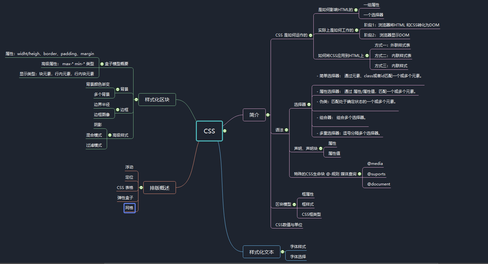

# 1简介

CSS 的作用：样式化和排班网页 ---- 例如如何更改网页的字体、颜色、大小，将内容分割成多列或者加入动画以及别的装饰效果。


本文将通过讲述CSS 的工作原理，包括选择器是什么，属性是什么，如何撰写CSS规则，如何将CSS应用到HTML，CSS中如何描述长度、颜色以及其他属性的计量单位，关于层叠与继承的知识和如何进行CSS的调试工作，带你走上掌握CSS的道路。 


目录：


1.  CSS 是如何工作的
2.  CSS 语法
3.  选择器 
4.  CSS 的值和单位
5.  层叠和集成
6.  框模型
7.  调试 CSS


# 2. CSS是如何运作的

## 2.1 什么是CSS？


CSS 是一种指定向用户指定文档如何呈现的语言 --  他们如何被指定样式布局等。

文档包括 HTML、SVG 或者 XML。


## 2.2 CSS 如何影响 HTML

CSS 的组成规则：

- 一组属性
- 一个选择器


即CSS 通过 选择器和一组属性影像所选择的元素的。即整个HTML。

## 2.3 CSS 实际上如何工作


两个二阶段：

1. 浏览器将 HTML 和 CSS 转化为 DOM。
2. 浏览器显示 DOM 的内容。


## 2.4 如何将 CSS 应用到 HTML上？

三种方式：

1. 外联样式表
2. 内联样式表
3. 内联样式


# 3 语法

目标： 学习CSS 的基本语法结构。


从基本层次看，CSS油两块内容组成：

- 属性。
- 属性值。


#### CSS 声明

#### CSS 声明块

#### CSS 选择器和规则


### 特殊的CSS声明块


- @-规则（At-rules）在css中被用来传输元数据，条件信息，或者其他描述性喜。

- 嵌套语句 是 @-规则中的一种，他的语法是CSS规则的嵌套块，只有在特定条件匹配时才会应用到文档上，特定条件如下：

  - [`@media`](https://developer.mozilla.org/zh-CN/docs/Web/CSS/@media) 只有在运行浏览器的设备匹配其表达条件时才会应用该@-规则的内容；

  - [`@supports`](https://developer.mozilla.org/zh-CN/docs/Web/CSS/@supports) 只有浏览器确实支持被测功能时才会应用该@-规则的内容；

  - [`@document`](https://developer.mozilla.org/zh-CN/docs/Web/CSS/@document) 只有当前页面匹配一些条件时才会应用该@-规则的内容。

    具体语法示例：

    ```css
    @media (min-width: 801px) {
      body {
        margin: 0 auto;
        width: 800px;
      }
    }
    ```


### 语法之外：


#### 空格 （美化）

#### 注释

#### 简写 （padding: 10px 15px 15px 5px;）


# 4. 选择器简介

## 4.1 基础


#### 4.1.1 不同种类的 CSS 选择器：

- 简单选择器： 通过元素、class或者id匹配一个或多个元素。
- 属性选择器： 通过 属性/属性值，匹配一个或多个元素。
- 伪类：匹配处于确定状态的一个或多个元素。
- 组合器： 组合多个选择器。
- 多重选择器：逗号分隔多个选择器。


## 4.2.简单选择器


### 4.2.1 类选择器


```css
.first {
  font-weight: bold;
}
```


### 4.2.2 ID选择器

```css
#polite {
  font-family: cursive;
}
```


### 4.2.3 通用选择器

 （ * ) 号匹配所有元素

```css
* {
  padding: 5px;
  border: 1px solid black;
  background: rgba(255,0,0,0.25)
}
```


## 4.3  属性选择器


### 4.3.1 存在和值 属性选择器

这些属性选择器尝试匹配精准的属性值：

* [attr] : 该选择器选择包含attr属性的所有元素，不论attr的值为何。 

* [attr=val] : 该选择器仅选择attr的属性值为val的所有元素。

* [attr~=val] : 该选择器仅选择具有attr=属性，而且val值是attr值包含的被空格分割的取值列表中的一个。


```html
<li data-quantity="optional 150g" data-meat>Bacon bits</li>
```


### 4.3.1 子串值属性选择器


这种哦选择器也被成为伪正则选择器，类似正则，并不是真的正则。


- [attr!=val] : 选择属性值是 val 或者以 val- 开头的元素。
- [attr^=val] : 选择属性值以val开头的元素（包括val本身）。 
- [attr$=val] : 选择属性值以val结尾的元素（包括val本身）。 
- [attr*=val] : 选择属性值中包含**子**字符串val的元素 .


## 4.4.伪选择器


伪选择器不是选择元素，而是选择元素的某些部分，或者仅在某些特定上下文中存在的元素。他们有两个主要类型：**伪类和伪元素**。


### 4.4.1 伪类


一个CSS 伪类，是以冒号（:）作为前缀的。

```css
a:hover{
  color: darkred;
  text-decoration: none;
}
```


### 4.4.2 伪元素


一个 CSS 伪元素，是以双冒号（::）为前缀的。

- [`::after`](https://developer.mozilla.org/zh-CN/docs/Web/CSS/::after)
- [`::before`](https://developer.mozilla.org/zh-CN/docs/Web/CSS/::before)
- [`::first-letter`](https://developer.mozilla.org/zh-CN/docs/Web/CSS/::first-letter)
- [`::first-line`](https://developer.mozilla.org/zh-CN/docs/Web/CSS/::first-line)
- [`::selection`](https://developer.mozilla.org/zh-CN/docs/Web/CSS/::selection)
- [`::backdrop`](https://developer.mozilla.org/zh-CN/docs/Web/CSS/::backdrop)


例如通过伪元素在 a标签后加后缀


```html
<ul>
  <li><a href="https://developer.mozilla.org/en-US/docs/Glossary/CSS">CSS</a> defined in the MDN glossary.</li>
  <li><a href="https://developer.mozilla.org/en-US/docs/Glossary/HTML">HTML</a> defined in the MDN glossary.</li>
</ul>
```

```css
/* 所有含有"href"属性并且值以"http"开始的元素，
将会在其内容后增加一个箭头（去表明它是外部链接）
*/

[href^=http]::after {
  content: '⤴';
}
```

效果：


## 4.5 组合器和多个选择器

| 选择器组       | A,B        | 匹配满足A（和/或）B的任意元素（参见下方 [同一规则集上的多个选择器](https://developer.mozilla.org/zh-CN/docs/Learn/CSS/Introduction_to_CSS/Combinators_and_multiple_selectors#%E5%90%8C%E4%B8%80%E8%A7%84%E5%88%99%E9%9B%86%E4%B8%8A%E7%9A%84%E5%A4%9A%E4%B8%AA%E9%80%89%E6%8B%A9%E5%99%A8)）. |
| -------------- | ---------- | ------------------------------------------------------------ |
| 后代选择器     | A B A >> B | 匹配B元素，满足条件：B是A的后代结点（B是A的子节点，或者A的子节点的子节点） |
| 子选择器       | A > B      | 匹配B元素，满足条件：B是A的直接子节点                        |
| 相邻兄弟选择器 | A + B      | 匹配B元素，满足条件：B是A的下一个兄弟节点（AB有相同的父结点，并且B紧跟在A的后面） |
| 通用兄弟选择器 | A ~ B      | 匹配B元素，满足条件：B是A之后的兄弟节点中的任意一个（AB有相同的父节点，B在A之后，但不一定是紧挨着A） |


## 4.6 串联与集成


CSS 的样式确定最终是通过层叠机制和样式继承确定的。


### 4.6.1 层叠

在CSS的层叠机制中，什么选择器在层叠中取胜取决于这三个因素：

1. 重要性 （Importance）
2. 专用型 （Specificity）
3. 源代码次序（Source order）


#### 重要性

首先 ！important 会定义个最高级别的重要性，可以让一条规则总是优于其他规则。

> 重载这个 `!important` 声明的唯一方法是在后面的源码或者是一个拥有更高专用性的源码中包含相同的 `!important` 特性的声明。


对于重要性而言，相互冲突的声明将按照以下顺序适用，后一种将覆盖闲钱的声明：


1. 在用户代理样式表的声明（浏览器的默认样式）
2. 用户样式表中的普通声明（由用户设置的自定义样式）
3. 作者样式表中的普通声明
4. 作者样式表中的重要声明
5. 用户样式表中的重要声明


#### 专用性


专用性基本上是衡量选择器具体成都的一种方法 ---- 它能匹配多少元素。具体来说，元素选择器具有很低的专用型，类选择器具有较高的专用型，所以战胜元素选择器。ID选择器有更高的专用性。战争ID选择器的额唯一方法就是使用 Iimportant。

一个选择器具有的专用性的量是用四种不同的值来衡量的，他们可以被认为是 千位，百位，十位，个位 --- 在四个列中的四个简单数字：

1. 千位：如果声明是在`style` 属性中该列加1分（这样的声明没有选择器，所以它们的专用性总是1000。）否则为0。
2. 百位：在整个选择器中每包含一个ID选择器就在该列中加1分。
3. 十位：在整个选择器中每包含一个类选择器、属性选择器、或者伪类就在该列中加1分。
4. 个位：在整个选择器中每包含一个元素选择器或伪元素就在该列中加1分。


这只是一个类比，如果存在千位的，那么即便有10个百位的也不能超过千位的专用性。


总的来说，专用性就是说这个选择器是否更明确。更明确则有效性更好。

例如：


```css
/* specificity: 0101 */
#outer a {
  background-color: red;
}

/* specificity: 0201 */
#outer #inner a {
  background-color: blue;
}

/* specificity: 0104 */
#outer div ul li a {
  color: yellow;
}

/* specificity: 0113 */
#outer div ul .nav a {
  color: white;
}

/* specificity: 0024 */
div div li:nth-child(2) a:hover {
  border: 10px solid black;
}

/* specificity: 0023 */
div li:nth-child(2) a:hover {
  border: 10px dashed black;
}

/* specificity: 0033 */
div div .nav:nth-child(2) a:hover {
  border: 10px double black;
}
```


#### 源代码层次

如上所述，如果多个相互竞争的选择器具有相同的重要性和专用性，那么第三个因素将帮助决定哪一个规则获胜。


源码层次是指： 后面的规则将战胜先前的规则，如下，第二个声明将会生效。

```css
p {
  color: blue;
}

/* This rule will win over the first one */
p {
  color: red;
}
```


#### 关于规则混合的一点注记

所有这些规则都是发生在属性级别上的。


### 4.6.2 继承


哪些属性默认被继承哪些不被继承大部分符合常识。


#### 控制继承

CSS 为处理继承提供了四种特殊的通用属性值：


* inherit：改值将应用到选定元素的属性值设置为与其父元素一样。
* initial：该值将应用到选定元素的属性值设置为与浏览器默认样式中改元素设置的值一样，如果浏览器样式表中没有默认设置，并且是自然继承的，那么该属性值就被设置为inherit。
* unset：该值将属性重置为其自然值，即如果属性是自然继承的，那么他的表现就像inhert，否则就表现的向initial。
* revert：如果当前的节点没有应用样式，则将该属性恢复到他所拥有的值。换句话说，属性值被设置成自定义样式所定义的属性（如果被设定了），否则属性值被设置成用户代理的默认样式。


> **注意**: `initial` 和 `unset` 不被IE支持。


#### 重新设置所有的属性值


CSS 速写属性 **all** 能够被应用到每一个继承属性，一次性应用所有的几成属性。


# 5 区块模型


CSS 框模型是网页布局的基础 -- 每个元素被表示为一个矩形的方框。由框内容，内边距，外边距组成。


### 5.1 框属性

* width 和 height：  设置**内容框（content box）**的宽度和高度.内容框是框内容显示的区域----包括框内文本内容，以及表示嵌套子元素的其他框。
* padding： 表示一个 CSS 的内边框。
* border： 表示CSS框的边界。
* margin： 表示CSS框周围的外部区域。

> 外边距有一个特别的行为被称作[外边距塌陷（margin collapsing）](https://developer.mozilla.org/zh-CN/docs/Web/CSS/CSS_Box_Model/Mastering_margin_collapsing)：当两个框彼此接触时，它们的间距将取两个相邻外边界的最大值，而非两者的总和。 


### 5.2 高级的框操作


#### 溢流


当内容区域大于框的设置宽高的时候，会造成溢流。可以通过overflow来控制：

* auto：滚动显示
* hidden：隐藏
* visible： 显示在外边（默认）

#### 背景裁剪

通常情况下，框的背景设置是延伸到边界沿的，可以通过设置盒子的 background-clip属性来调整。

```css
.default     { background-clip: border-box;  }
.padding-box { background-clip: padding-box; }
.content-box { background-clip: content-box; }
```


#### 轮廓


一个框的 outline 是一个看起来像是外边界，但是又不属于框模型的东西。他的行为和外边界差不多，但是并不改变框的尺寸。


### 5.3 CSS框类型

可以通过 display属性来设置多种不同的框类型，不同的框类型下，框的属性表现会有所不同。常用的是一下三个类型：block，inlin和inlin-block

* 块框（block box）：内容独占一行，可以设置宽高。
* 行内框（inlin box）： 行内框可以与其他元素出现在同一行，行内框设置宽高无效。设置padding，margin，border 都会更新周围文字的位置，但是对于周围的块框不影响。
* 行内块框（inline-block box）：行内块框可以与其他元素出现在同一行，一样会随着周围文字而流动，但是可以设置宽高，并且向块框一样保持了器块特性的完整性，

**一句话总结行内块，对外是行内元素，对内是块元素。**


# 6 CSS 的数值与单位


本文介绍CSS的常用单位和数值。


### 6.1 数值


#### 长度和尺寸

绝对单位：

* mm，cm，in ：毫米（Millimenters），厘米（centimeters），英寸（inches）
* pt，pc：点（Points（^1^/~72~ of an inch）） 十二点活字（ picas (12 points.)）

相对单位：

* em：1em与当前元素的字体大小相同。但是em单位是会继承父元素的字体大小。
* ex，ch：分别是小写x的高度和数字0的宽度。支持度不高、
* rem：REM（root em）和em以同样的方式工作，但它总是等于默认基础字体大小的尺寸；不受继承影像。但是在旧版ie上不支持。
* vw，vh：分别是视口宽度的1/100和视口高度的1/100，其次，它不像rem那样被广泛支持。


#### 无单位的值

在某些情况下，使用无单位的数值是完全允许的。例如 ： margin: 0;

##### 无单位的行高： 

你可以使用单位设置特定的行的高度，但使用一个无单位的值往往更容易，它就像一个简单的乘法因子， 如下：


```css
p {
  line-height: 1.5;
}
```


##### 动画的数值

例如：最后一行

```css
p:hover {
  animation-name: rotate;
  animation-duration: 0.6s;
  animation-timing-function: linear;
  animation-iteration-count: 5;
}
```


### 6.2 百分比

通常使用百分比来实现动态布局。

例如动态的字体大小，区域大小。


### 6.3 颜色

CSS中指定颜色的方法有很多，其中一些是最近实现的。CSS中到处都可以使用相同的颜色值，无论是指定文本颜色、背景颜色，还是其他任何颜色。


#### 关键词

CSS中最简单、最古老的颜色类型就是颜色关键词。

```css
p {
  background-color: red;
}
```

#### 十六进制

```css
p:nth-child(1) {
  background-color: #ff0000;
}
```

#### RGB

一个RGB值是一个函数——rgb() ——给定的三个参数，分别表示红色，绿色和蓝色通道的颜色值，这与十六进制值的工作方式大致相同

```css
p:nth-child(1) {
  background-color: rgb(255,0,0);
}
```


>RGB值的支持度与十六进制不相上下，在你的工作中你可能不会遇到不支持它们的浏览器。
>
>RGB值可以说比十六进制值更直观，更容易理解。


#### HSL

支持度比RGB稍微差一点的是HSL

`hsl()`函数接受三个表示**色调**、**饱和度**以及**明度**的参数，使用与上述三种不同的方式来区分大约1670万种颜色：


```css
p:nth-child(1) {
  background-color: hsl(0,100%,50%);
}
```


#### RGBA 和 HSLA

RGB和HSL都有相应的模式——RGBA和HSLA——不仅允许您设置想要显示的颜色,还有此颜色的**透明度（** **transparency** ）

```css
/* Transparent red */
p:nth-child(1) {
  background-color: rgba(255,0,0,0.5);
  position: relative;
  top: 30px;
  left: 50px;
}

/* Transparent blue */
p:nth-child(2) {
  background-color: hsla(240,100%,50%,0.5);
}
```


#### 不透明度

还有另一种方法来指定透明度，通过CSS——[`opacity`](https://developer.mozilla.org/zh-CN/docs/Web/CSS/opacity) 属性。与设置某个特定颜色的透明度相比，这会设置所有选定元素以及它们的孩子节点的不透明度。

```css
/* Red with opacity */
p:nth-child(2) {
  background-color: rgb(255,0,0);
  opacity: 0.5;
}
```


 