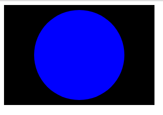

# 1. 多媒体与嵌入概述


>HTML 中多媒体的嵌入包括音频、视频、图片、和 iframe，本章介绍了这些资源的引用及特性。


# 2. HTML 中的图片

使用 img 标签，在 HTML 中嵌入一张图片。

## 2.1 怎样将一幅图放在网页上？

img 标签的 src 属性包含了指向我们想要引入的图片路径，可以是相对路径或者是绝对 URL。

推荐将图片存储在 HTML 页面同路径的 images 文件夹下（这也是 google 推荐的做法，有利于 SEO/索引）,例如：

	

也可以是用绝对路径，例如：

	


**注意： 像 img 和 video 这样的元素，有时被称为替换元素，因为这样的元素的内容和尺寸由外部资源（像一个图片或视频文件） 所定义，而不是元素自身。**

## 2.2 备选文本

alt 属性，改值对应的是图片的文字描述，用于在图片无法显示或不能被看到的情况。例如：

	


## 2.3 宽度和高度

给定宽高的情况下，如果图片还没加载完成，浏览器则会为要显示的图片留下指定的空间：

	

   


   
​     

## 2.4 图片标题 title


区分 title 和 alt 的区别。 alt 是只有在图片位显示时用于替换图片的。title 则和普通元素的 title 一样。


## 2.5 根据图片的作用来配置 alt 和 title

* 装饰 
* 内容
* 链接
* 文本


​	

# 3. 视频和音频内容

使用 vide 和 audio 标签为 HTML 文档添加视频和音频内容。

如何为视频添加字幕？

## web 中的音频和视频

在早些时候，传统的 web 技术（如 HTML ）不能够在 Web 中嵌入音频和视频，所以一些像 Flash (后来有 Silverlight ) 的专利技术在处理这些内容上变得很受欢迎。这些技术能够正常的工作，但是却有着一系列的问题，包括无法很好的支持 HTML/CSS 特性、安全问题，以及可行性问题。


几年之后 HTML5 标准提出，其中有许多的新特性，包括 <video> 和 <audio> 标签，以及一些 JavaScript 和 APIs 用于对其进行控制。


### 3.1 video 标签

video 标签允许你嵌入一段视频：

	<video src="rabbit320.webm" controls>
	  <p>Your browser doesn't support HTML5 video. Here is a <a href="rabbit320.webm">link to the video</a> instead.</p> 
	</video>

其中的一些属性如下：

* src：
	​	
	同 img 标签使用方式相同，src 属性指向你想要嵌入网页当中的视频资源，他们的使用方式完全相同。

* cotrols 

	视频控制接口，包括暂停、播放、调整音量等功能。
	
* video 标签内段落

	这个叫做后备内容 — 当浏览器不支持 <video> 标签的时候，它将会显示出来，它使我们能够对旧的浏览器做一些兼容处理。


#### 3.1.1 多格式支持


由于不同的浏览器支持的视频格式不同，当使用src来引用视频地址时就会出现只有一部分浏览器能打开视频。


WebM 和 MP4 这两种格式目前已经足够支持大多数平台和浏览器。

* WebM 主要在 FireFox 和 Chrome 中支持。
* MP4 主要在 IE 和 Safari 中支持。


可以通过使用 <source> 标签来引用多个视频地址，来兼容多个格式。浏览器会根据type判断是否支持该格式，如果并不支持则会跳过。


```html
<video controls>
  <source src="rabbit320.mp4" type="video/mp4">
  <source src="rabbit320.webm" type="video/webm">
  <p>Your browser doesn't support HTML5 video. Here is a <a href="rabbit320.mp4">link to the video</a> instead.</p>
</video>
```


####  3.1.2 其他特性


* width 和  height 属性，用来控制视频宽高，也可以用css。但是无论用什么方式，视频都会保持原始的宽高比，
* autoplay 这个属性会使音频和视频内容立即播放，即使页面的其他部分还没有加载完全。
* loop 循环播放。
* muted 关闭声音。
* poster 指向一个图像，在视频播放前显示，用于预览。
* preload 缓冲，有 3 个可选值：
  *  ‘none' ： 不缓冲，
  * ’auto'： 页面加载后缓存媒体文件。
  *  ‘metadata’ ：仅缓冲文件的元数据。


### 3.2   audio 标签


 <audio> 与 <video> 的使用方式基本相同，典型的例子如下：


```html
<audio controls>
  <source src="viper.mp3" type="audio/mp3">
  <source src="viper.ogg" type="audio/ogg">
  <p>Your browser doesn't support HTML5 audio. Here is a <a href="viper.mp3">link to the audio</a> instead.</p>
</audio>
```


效果如下：


audio标签不支持width、height，poster 属性。应为没有视觉部件。

除此之外， audio 标签支持所有video标签拥有的特性。


### 3.3 显示音轨文本


HTML5 的支持通过 <track> 标签设置音频内容的副本（文本、翻译，视频文字转音频）。该标签使用 WebVTT 格式的文件。


WebVTT 文件以  .vtt 后缀保存文件。

WebVTT 描述字符串在视频中显示的时间，样式及定位信息。这些字符串叫做 **cues** ，最常见的如下：


* subtitle 添加字幕，可以是翻译字幕。
* captions 同步翻译对白，或者是描述一些重要信息的**声音**。
* timed descriptions 将文字转为音频。


一个典型的webVTT文件如下：


```html
WEBVTT

1
00:00:22.230 --> 00:00:24.606
This is the first subtitle.

2
00:00:30.739 --> 00:00:34.074
This is the second.

  ...
```


用法如下：

使用 kind 指明属于哪一种类型，用 srclang 来声明文本语言。


```html
<video controls>
    <source src="example.mp4" type="video/mp4">
    <source src="example.webm" type="video/webm">
    <track kind="subtitles" src="subtitles_en.vtt" srclang="en">
</video>
```


# 4. 从对象到 iframe -- 其他嵌入技术


由框架集的网站设计模式需求而来的嵌入技术。最初使用<object> 和 <embed>，后来这些技术由于安全性、可访问性、文件大小等原因不在被支持。最后 <iframe>（连同其他嵌入元素，如 <canvas>,<video>等）元素出现，提供了更好的解决方案---- 整页嵌入。


### iFrame 详解

更简单更安全。


```html
<iframe src="https://developer.mozilla.org/en-US/docs/Glossary"
        width="100%" height="500" frameborder="0"
        allowfullscreen sandbox>
  <p> <a href="https://developer.mozilla.org/en-US/docs/Glossary">
    Fallback link for browsers that don't support iframes
  </a> </p>
</iframe>
```


**基本要素：**


* allowfullscreen： 设置为全屏模式。
* frameborder： 边框设置（推荐使用css设置边框）。
* src： 嵌入的文档路径。
* width,height: iframe的宽高。
* 备选内容： 在iframe 标签中添加其他内容，在浏览器不支持ifrma时显示。
* sandbox： 该属性在已支持的更高版本的现代浏览器撒上有意义，可以提高安全性。


提高安全性的策略：

1. 使用HTTPS
2. 始终使用 sandbox 属性
3. 服务器配置CSP指令，限制其他网站在网页中嵌入当前页面。


### embed 和 object 元素

embed 和 object 用于嵌入其他类型的外部内容的通用工具。


这两个元素依然是不推荐的元素，因为现代浏览器的web已经越来越强大，不需要太多的插件，而很多以往插件 的功能，也有了新的HTML特性去替换。


# 5. 为 web 新增向量图


矢量图形： 以较小的文件尺寸，存储高度可缩放的图像文件。

现有的两种图片类型： 矢量图和位图。


> 矢量图使用算法来定义 ---- 一个矢量图文件包含了图形和路径的定义，电脑可以根据这些定义来计算出当他们在屏幕上渲染时应该呈现的样子。SVG格式可以让我们创造适用于Web的酱菜的矢量图形。


### SVG 是什么？


SVG 是用于描述矢量图像的XML语言。例子如下：


```html
<svg version="1.1"
     baseProfile="full"
     width="300" height="200"
     xmlns="http://www.w3.org/2000/svg">
  <rect width="100%" height="100%" fill="black" />
  <circle cx="150" cy="100" r="90" fill="blue" />
</svg>
```





**优点**

* 矢量图像中的文仍可访问（这也有利于SEO）。
* SVG 可以很好的适应样式/脚本，因为图像的每个组件都是可以通过CSS或者通过JavaScript编写的样式元素。

**与光栅图像相比的缺点**


* SVG 很容易变得复杂。
* SVG可能比光栅图像更难创建。
* 旧版浏览器不支持SVG


### 将SVG添加到页面


#### 快捷方式： img


通过 img 元素嵌入SVG。

```html

```


**优点**

* 快速
* 可以通过 a 元素嵌套 img 使图像成为超链接。


**缺点**


* 无法使用JavaScript操作图像
* 无法使用HTML中的CSS控制SVG中的样式。
* 不能调用 CSS 伪类来重设图像样式。


对于不支持SVG的浏览器（IE8以及更低版本，Android2.3 及更低版本）的浏览器，可以使用src引用PNG或JPG，然后使用srcset属性引用svg。此时在支持svg的浏览器中将加载svg，在旧的浏览器中将加载PNG。

```html

```


在css 中可以 使用如下方式进行兼容：

```
background: url("fallback.png") no-repeat center;
background-image: url("image.svg");
background-size: contain;
```


#### 在HTML中引入SVG代码


直接在HTML文档中编辑SVG代码，就像普通便签一样。

```html
<svg width="300" height="200">
    <rect width="100%" height="100%" fill="green" />
</svg>
```


**优点**


* 可以使用HTML中的样式，可以通过JavaScript操控SVG元素。
* 减少HTTP请求。
* 也可以将SVG标签包括在A标签中。

**缺点**


* 文件太大了肯定不好。
* 不能缓存。


#### 使用 iframe 嵌入SVG


如下： 

```html
<iframe src="triangle.svg" width="500" height="500" sandbox>
    
</iframe>
```


***这绝对不是最好方法***


# 6. 自适应图片


在不同的设备上使用不同尺寸，不同分辨率的图片，以提升页面展示效果和用户体验。

解决方案：

* 艺术方向问题：在小屏幕上使用包含原本图片重要信息的裁剪版本。
* 分辨率切换问题：在不同的屏幕分辨率下使用不同分辨率的图片版本。

如何创建自适应图片：


#### 分辨率切换： 不同尺寸


使用两个新属性 **srcset** 和 **sizes**，来提供更多额外的资源图像和提示。

```html

```


* **srcset** 定义了允许浏览器选择的图像集以及每个图像的大小。

  1. 一个文件名（elva-fariy-320w.jpg）

  2. 一个空格

  3. 图像的固有宽度（以像素为单位）（320w） -- 这里使用 w 作为单位。指图像的真实大小。

* **sizes** 定义了一组媒体条件（例如屏幕宽度），并指明在某些媒体条件为真时，应该使用什么样的尺寸的图片。

  1. 一个**媒体条件**   ((max-with：480px))。
  2. 一个空格。
  3. 当媒体条件为真时，图像将填充的槽的宽度（440px）-- 这个宽度可以用 px ，em vw 作为单位，但是不能使用百分比，最后一个 800px 没有媒体条件，将作为默认使用。


  > 这些条件的判断顺序是从上往下一次执行。最后一个是默认条件。


浏览器的具体执行过程如下：


1. 查看设备宽度
2. 检查 sizes 列表中哪一个媒体条件是第一个为真的
3. 查看给与改媒体查询的槽的大小
4. 加载 srcset 列表中引用的最近接所选的槽大小的图像


对于不支持这些特性的浏览器可以继续读取 src 属性。


### 分辨率切换： 相同的尺寸，不同的分辨率

使用 srcset 和 x 语法结合实现不同分辨率的选择。

```html

```


#### 艺术方向

使用 picture 元素实现更为丰富的图片适配。

```html
<picture>
  <source media="(max-width: 799px)" srcset="elva-480w-close-portrait.jpg">
  <source media="(min-width: 800px)" srcset="elva-800w.jpg">
  
</picture>
```


* source 元素的 media 属性设置媒体条件，srcset 属性设置改条件下选用的图片。
* srcset 可以设置多个图片路径，实现同一个尺寸的不同分辨率设置。
* source 元素同样也有 sizes 属性。所以也可以使用一个 source 元素实现多个尺寸的适配。
* picture 依然需要有 img 标签来设置默认的图片，以及在浏览器不支持 picker 的情况下的图片。


#### 为什么不适用 css 或者 JavaScript 来实现适配


因为 JavaScript 需要先加载图片后再才能进行设置，这就会造成一个显示的过渡阶段。

**CSS 的原因还不太明白，等看了 CSS 后在考虑吧。**


#### 大胆使用现代图像格式

有很多令人激动的新图像格式（例如WebP和JPEG-2000）可以在有高质量的同时有较低的文件大小。然而浏览器支持却参差不齐。

不过可以使用 piture 来实现满足新式浏览器的同时又满足老式浏览器。可以使用 type 属性提供 MIME 类型，这样浏览器就能立即拒绝其不支持的文件类型。

```html
<picture>
  <source type="image/svg+xml" srcset="pyramid.svg">
  <source type="image/webp" srcset="pyramid.webp"> 
  
</picture>
```


- 不要使用`media`属性，除非你也需要艺术方向。
- 在`<source>` 元素中，你只可以引用在`type`中声明的文件类型。
- 像之前一样，如果必要，你可以在`srcset`和`sizes`中使用逗号分割的列表。


