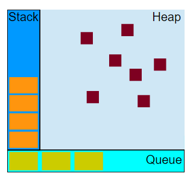

JavaScript 的并发模型是基于”事件循环“的。


### 运行时概念

下面的内容解释了一个理论上的模型。 现代JavaScript引擎着重实现和优化了描述的几个语义。

可视化描述：



#### 栈

#### 堆

#### 队列

一个 JavaScript 运行时包含了一个待处理的消息队列。每一个消息都有一个为了处理这个消息相关联的函数。

在[事件循环](https://developer.mozilla.org/zh-CN/docs/Web/JavaScript/EventLoop#Event_loop)期间的某个时刻，运行时总是从最先进入队列的一个消息开始处理队列中的消息。正因如此，这个消息就会被移出队列，并将其作为输入参数调用与之关联的函数。为了使用这个函数，调用一个函数总是会为其创造一个新的栈帧，一如既往。

函数的处理会一直进行直到执行栈再次为空；然后事件循环将会处理队列中的下一个消息（如果还有的话）。


### 事件循环

之所以称为事件循环，是因为它经常被用于类似如下的方式来实现：

```js
while (queue.waitForMessage()) {
  queue.processNextMessage();
}
```

#### 执行完成

每一个消息完整的执行后，其它消息才会被执行。

这个模型的一个缺点在于当一个消息需要太长时间才能完成，Web应用无法处理用户的交互，例如点击或滚动。浏览器用“程序需要过长时间运行”的对话框来缓解这个问题。一个很好的做法是使消息处理缩短，如果可能，将一个消息裁剪成几个消息。


#### 添加消息

在浏览器里，当一个事件出现且有一个事件监听器被绑定时，消息会被随时添加。

调用 `setTimeout` 函数会在一个时间段过去后在队列中添加一个消息。这个时间段作为函数的第二个参数被传入,时间参数的值代表了消息被实际加入到队列的最小延迟时间。如果队列中没有其它消息，消息会被马上处理。但是，如果有其它消息，`setTimeout`消息必须等待其它消息处理完。因此第二个参数仅仅表示最少的时间 而非确切的时间。


#### 零延迟

零延迟并不是意味着回调会立即执行。在零延迟调用 [`setTimeout`](https://developer.mozilla.org/zh-CN/docs/Web/API/WindowTimers/setTimeout) 时，其并不是过了给定的时间间隔后就马上执行回调函数。其等待的时间基于队列里正在等待的消息数量。


#### 多个运行时通信

一个 web worker 或者一个跨域的`iframe`都有自己的栈，堆和消息队列。两个不同的运行时只能通过 `postMessage`方法进行通信。如果后者侦听到`message`事件，则此方法会向其他运行时添加消息。


### 永不阻塞

JavaScript 的一个非常有趣的特性是事件循环模型，与许多其他语言不同，它永不阻塞。 处理 I/O 通常通过事件和回调来执行，所以当一个应用正等待`IndexedDB`查询返回或者一个 [XHR](https://developer.mozilla.org/zh-CN/docs/DOM/XMLHttpRequest) 请求返回时，它仍然可以处理其它事情，如用户输入。