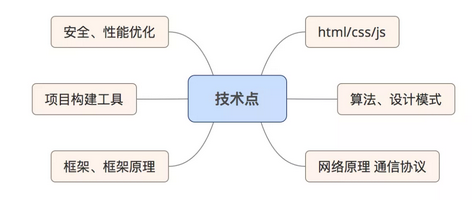

* 前端的细分
* 前端的范围
* 前端工程化
* 规划

## 技术基础：

比如 《JavaScript 高级程序设计》有没有吃透？原型，继承，闭包等等。

基础算法、设计模式等扎实不扎实？

计算机网络原理、http协议掌握到什么程度？

如何做性能优化，有没有一套完整解决思路？

常见一些框架除了会使用，有没有进一步思考？比如 底层原理，适用场景、特性、优缺点等。

后端的一些东西懂多少，怎么跟后端做 Restful 开发？

